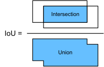
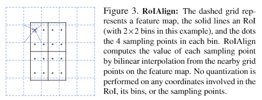

# Basic Concepts

## Bounding Boxes/BBoxes

表示物体位置的矩形框，通常用中心点坐标+长宽或者左上+右下坐标表示其位置和大小

## Anchor Boxes

预先设定好比例的候选框的集合，用于在其基础上回归出真实框的位置和大小

## Intersection over Union (IoU)

交并比

$$J(\mathcal{A},\mathcal{B}) = \frac{\left|\mathcal{A} \cap \mathcal{B}\right|}{\left| \mathcal{A} \cup \mathcal{B}\right|}.$$

## Non-Maximum Suppresion (NMS)

非极大值抑制，在输出结果阶段，针对某个目标可能会有大量重叠的预测框，根据NMS规则对相近的预测框进行删除。简单来说就是“去同存异”。

* 对于每一个类别，找到判定为该类别的检测框，按照置信度排序，序列为$L$。初始化一个空的序列$L-keep$，用来存放需要留下的检测框
* 选择$L$中置信度最高的检测框B，从L中找到所有与$B1$的IoU大于某个阈值$\epsilon$的检测框$B'$，将$B$和$B'$从L中删去，并将$B$存入需要$L-keep$中
* 重复step 2，直至$L$中为空。这时所有$L-keep$中的检测框两两之间不会有过于相似的

传统的NMS对重叠目标不够友好，会删除两个重叠目标的检测框。后续有进阶的soft-NMS可以使用。

阈值$\epsilon$需要手动设置属于超参数。

更多变体可参考[一文打尽目标检测NMS——精度提升篇](https://zhuanlan.zhihu.com/p/151914931)、[一文打尽目标检测NMS——效率提升篇](https://zhuanlan.zhihu.com/p/157900024)

## ROI Pooling/ROI Align

用于对不同大小和形状的输入进行特征提取，最终得到相同的特征图输出

通常来说模型给出的ROI的范围是浮点数，所以需要先进行一次取整和feature map的像素对齐。假设此时的ROI大小为(3,3)，但是要求输出(2, 2)的特征图，那么需要对3/2再进行一次取整，采样方案如下图所示：

两次取整会导致较大的误差。后续再Mask RCNN中提出了ROI Align，使用双线性插值代替取整，有效提升了模型预测的准确率。

## 子特征图

自己定义，为描述方便，定义经过RoI Pooling 或 Aligning的feature map 为子特征图