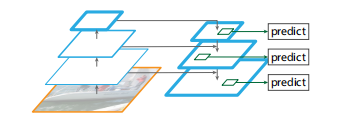
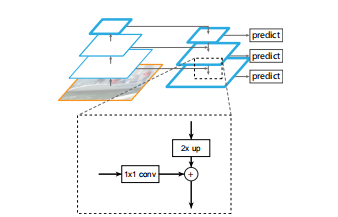

# Feature Pyramid Networks

## Introduction

* Time: 2016.12
* Author: Tsung-Yi Lin

FPN是一个多尺度物体检测特征提取方法，主要提升了小像素目标的检测效果。FPN构建了带有侧向连接的自顶向下结构。

## Detail

### 网络结构

FPN大致可以分为三个部分：Bottom-up pathway, Top-down pathway和lateral connections。

#### Bottom-up Pathway

在backbone中有很多的层网络都会输出同样大小的特征图，将这些层成为stage。FPN网络为每一个stage都定义一个金字塔层级，并且记录所有stage中的最后一个特征图。

#### Top-down pathway and lateral connections

## Reference

1. [【论文解读】小像素目标检测利器——FPN](https://zhuanlan.zhihu.com/p/84942241)
