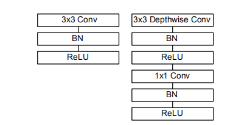
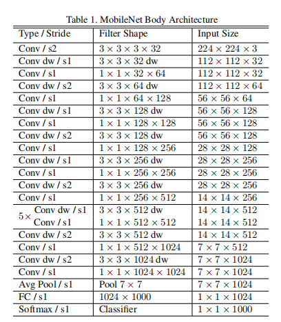

# MobileNets

## Introduction

* Time: 2017.04
* Author: Andrew G. Howard等

MobileNets是为了移动端的视觉任务开发的轻量级网络。主要创新点是深度可分离卷积。

## Detail

### Depthwise Separable Convolution

深度可分离卷积是指对输入特征图的每一个channel都单独做卷积，然后再用$1\times 1$卷积融合为输出的通道数量。

也可以理解为再进行deepthwise卷积时使用了一种维度为in_channels的卷积核进行特征提取，在进行pointwise卷积时只使用了output_channels个维度为$1\times 1\times in\_channels$的卷积进行特征融合。

下面与标准卷积进行对比，假设输入特征图**F**的维度为$D_F\times D_F\times M$，输出特征图**G**的维度为$D_F\times D_F\times N$

|            | 标准卷积                                            | 深度可分离卷积                                                            |
| ---------- | --------------------------------------------------- | ------------------------------------------------------------------------- |
| 卷积核维度 | $D_K\times D_K\times M\times N$                     | $D_K\times D_K\times 1\times N$ 以及 $1\times 1\times M\times N$          |
| 计算量     | $D_K\times D_K\times M\times N\times D_F\times D_F$ | $D_K\times D_K\times M\times D_F\times D_F+M\times N\times D_F\times D_F$ |

深度可分离卷积和标准卷积的计算量比例为：

$$
\frac{D_K\times D_K\times M\times D_F\times D_F+M\times N\times D_F\times D_F}{D_K\times D_K\times M\times N\times D_F\times D_F}=\frac{1}{N}+\frac{1}{D_K^2}
$$

## Reference

1. [轻量级网络-Mobilenet系列(v1,v2,v3)](https://zhuanlan.zhihu.com/p/394975928)
