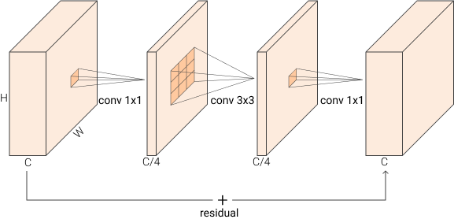
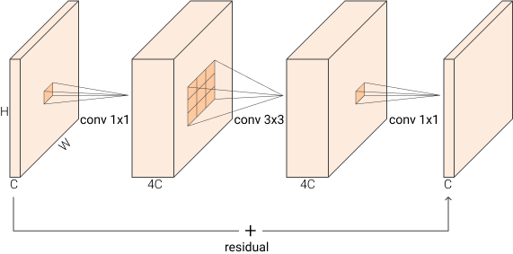
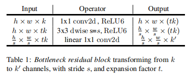
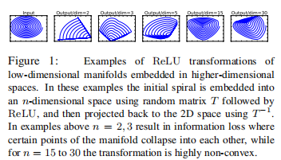

# MobileNetV2

## Introduction

* Time: 2018.01
* Author: Mark Sandler等

## Detail

### Bottleneck Blocks

该结构是在残差网络那篇文章中提出的。在一个Bottleneck Block中特征图的channel数先变小后变大，形如bottleNeck。

### Linear BottleNeck

一个Linear BottleNeck是BottleNeck Block去除了最后的激活函数的结果。

### Inverted Residual

顾名思义，就是反向的BottleNeck Blocks。将输入特征图的channel先变大再降低。

将上述二者和深度可分离卷积组合起来得到基本单元为Bottleneck residual block

### Intuition

在深度学习中，数据从输入流到输出，我们将其中有用的信息或者需要我们挖掘的信息成为manifold of interest (MoI)。本算法的创新之处就在于使用了Linear BottleNeck以及Inverted Residual最大程度保留和捕捉了MoI。

我们先来考虑ReLU激活函数。神经网络的线性层的输出有一半概率被ReLU置为0，有另外一半概率是恒等变换。所以ReLU很可能会破坏MoI，导致大量的信息缺失。

此外如果我们的MoI只是输入空间中的一个低维子空间，那么就算经过了ReLU，也有很大可能完整保留。简单解释如下图，将2为信息映射至15维以上再转换为2维之后，信息保留最完整。

综上所述，我们在MovileNetv2中即使用Linear BottleNeck也是用Inverted Residual。

## Reference

1. [Residual, BottleNeck, Inverted Residual, Linear BottleNeck, MBConv Explained](https://towardsdatascience.com/residual-bottleneck-inverted-residual-linear-bottleneck-mbconv-explained-89d7b7e7c6bc)