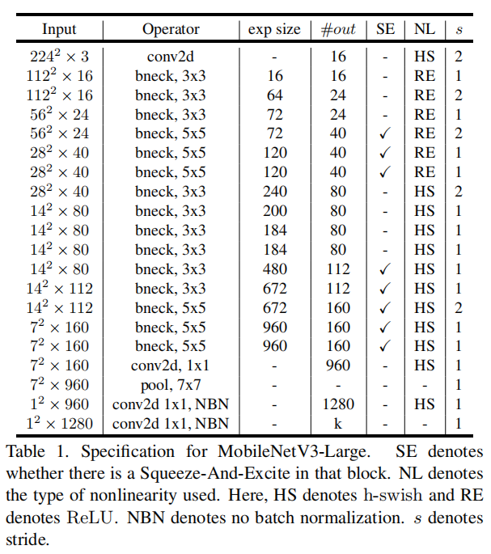
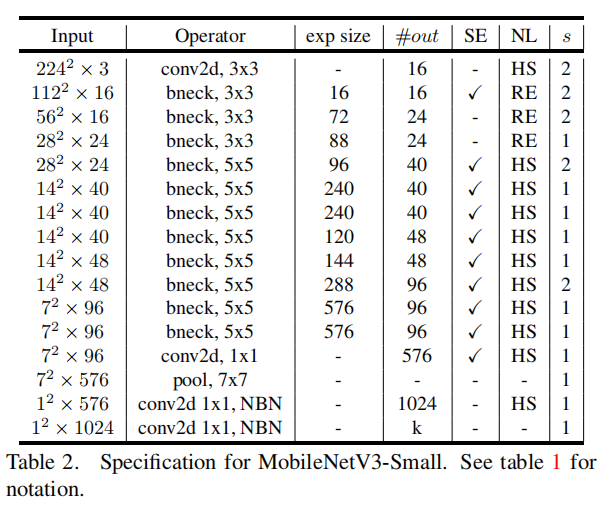
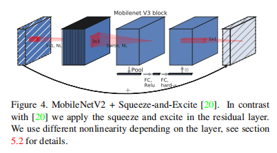

# MobileNetV3

## Introduction

* Time: 2019.5
* Author: Andrew Howard 等

该算法的结构是结合了Network Architecture Search (NAS)技术得到。最终得到了MobileNetV3-Large和MobileNetV3-Small两个模型。

## Detail

### Squeeze-and-Excitation结构

在MobileNetv2的bottleneck结构中增加了[Squeeze-and-Excitation](DeepLearning\ComputerVision\FeatureExtractor\1709.01507v4.pdf)结构。

因为SE结构会消耗一定的时间，所以作者在含有SE的结构中，将expansion layer的channel变为原来的1/4,这样作者发现，即提高了精度，同时还没有增加时间消耗。并且SE结构放在了depthwise之后。

### 修改网络尾部结构

在mobilenetv2中，在avg pooling之前，存在一个1x1的卷积层，目的是提高特征图的维度，更有利于结构的预测，但是这其实带来了一定的计算量，所以这里作者修改了，将其放在avg pooling的后面，首先利用avg pooling将特征图大小由7x7降到了1x1，降到1x1后，然后再利用1x1提高维度，这样就减少了7x7=49倍的计算量。并且为了进一步的降低计算量，作者直接去掉了前面纺锤型卷积的3x3以及1x1卷积，进一步减少了计算量，就变成了如下图第二行所示的结构，作者将其中的3x3以及1x1去掉后，精度并没有得到损失。

### 减少通道数

除了之前block中的通道数变为原来的1/4，第一个卷积之后的通道数也有32变为了16

### h-swish激活函数

swish激活函数被用来替换ReLU激活函数，从而提高神经网络的精度。

$$
{\rm swish}(x) = x\cdot \sigma(x)
$$

由于sigmoid计算较为复杂，所以采用了线性近似替代swish

$$
{\rm h-swish}(x)=x\frac{{\rm ReLU6}(x+3)}{6}
$$

## References

1. [如何评价google Searching for MobileNetV3?](https://www.zhihu.com/question/323419310)
2. [轻量级网络-Mobilenet系列(v1,v2,v3)](https://zhuanlan.zhihu.com/p/394975928)
