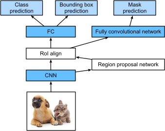

# Mask R-CNN

## Introduction

* Time: 2017.03
* Author: Kaiming He

## Detail

如上图所示，Mask R-CNN在Faster R-CNN的原有基础上并行增加了mask预测分支。同时使用[RoIAlign](..\Basic%20Concepts.md)代替原来的RoIPooling。

### Mask

使用FCN架构对RoI进行预测，得到k通道图，然后对k使用sigmoid进行0-1分类，预测该像素是否属于这一类。因为在预测框中已经有类别的预测了，所以只需要根据预测框的类别挑出对应通道即可。

### 训练阶段

如果一个RoI和一个真实框的IoU大于等于0.5，则被标注为positive，反之则标注为Negative。Loss-mask只计算positive RoI

### 推理阶段

先预测预测框，然后是NMS。然后跳出100个分数最高的检测框进行mask预测。这样可以减少RoI的数量并且提升准确率。

## Reference

1. [13.8.4. Mask R-CNN](http://d2l.ai/chapter_computer-vision/rcnn.html#mask-r-cnn)
