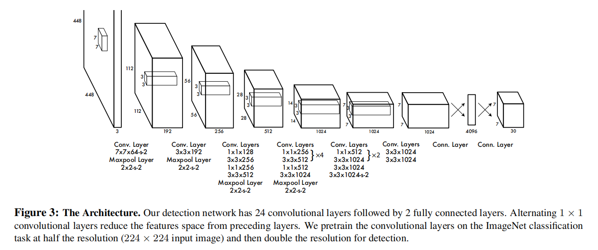

# YOLO (You Only Look Once)

## Introduction

* Time: 2015.06
* Author: Joseph Redmon, Santosh Divvala等

YOLO是一种基于Anchor的单阶段目标检测算法

## Detail

Backbone受启发于GoogLeNet，除了最后一层的输出使用了线性激活函数，其他层全部使用Leaky Relu激活函数。接下来是经过Backbone之后模型的检测头部分。

### 训练过程

经过Backbone之后，特征图的维度为$S \times S$，也就可以看作将输入图片划分为$S \times S$个网格，如果object的中心落在其中的一个网格中，那么这个网格就要负责这个object的检测。

每一个网格需要预测的内容包括：

* B个检测框，每个检测框对应着$x, y, w, h$
* 每个预测框包含一个物体的置信分数数学表达式为：$c = {\rm Pr(Object) \times IOU^{truth}_{pred}}$。这个置信分数也就是预测准确度的评分，这里是直接输出的结果，而不是分别计算两个部分的值然后再计算乘积，这样在推理阶段不需要计算IOU，也能预测出这个值。
* C个条件类别概率$p = {\rm Pr(Class_i|Object)}$

综上所述，一个grid对应的输出维度为$5\times B+C$，最终tensor的维度为$S\times S\times (5\times B+C)$，在原文中，$S=7，B=2，C=20$。

#### Loss

在训练过程中，每个grid只有IOU最高的预测框会参与损失的计算。这样能够让不同的预测器分工合作，每个预测器都有其擅长预测的大小、比例或者类别种类。

$$
\begin{align}
Loss = &\lambda_{coord}\sum_{i=0}^{S^2}\sum_{j=0}^B 1_{ij}^{obj}[(x_i-\hat{x}_i)^2+(y_i-\hat{y}_i)^2]\\
&+\lambda_{coord}\sum_{i=0}^{S^2}\sum_{j=0}^B 1_{ij}^{obj}[(\sqrt{w_i}-\sqrt{\hat{w}_i})^2+(\sqrt{h_i}-\sqrt{\hat{h}_i})^2]\\
&+\sum_{i=0}^{S^2}\sum_{j=0}^B 1_{ij}^{obj}(C_i-\hat{C}_i)^2\\
&+\lambda_{noobj}\sum_{i=0}^{S^2}\sum_{j=0}^B 1_{ij}^{noobj}(C_i-\hat{C}_i)^2\\
&+\sum_{i=0}^{S^2}1_i^{obj}\sum_{c\in classes}(p_i(c)-\hat{p}_i(c))^2
\end{align}
$$
$1_{i}^{obj}$表示如果object出现在grid $i$中， $1_{ij}^{obj}$表示grid $i$第j个预测器负责这个预测。(1)表示中心点回归误差；(2)表示长宽误差，平方根时为了防止不同大小的预测框给损失函数造成的差异过大；(3)(4)都是预测框置信度，当grid不含有物体时，$\hat{C}_i$应该为0，如果含有物体，则$\hat{C}_i$为IOU；(5)是分类误差

### 测试过程

仍然是输出三个部分，然后根据$c'$与某个阈值的大小确定是否保留该候选框。最后经过NMS得到输出的候选框。

$$c' =  {\rm Pr(Class_i|Object)\times Pr(Object)\times IOU^{truth}_{pred} = Pr(Class_i)*IOU^{truth}_{pred}} = p\times c$$
