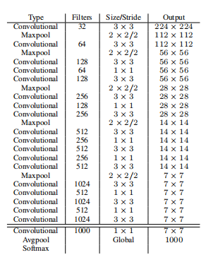
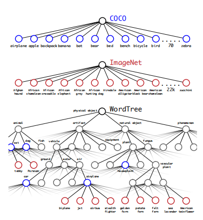
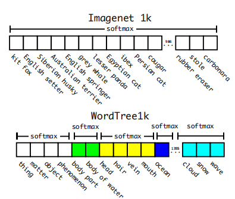

# YOLOv2

## Introduction

* Time: 2016.12
* Author: Joseph Redmon, Ali Farhadi

## Detail

### Better

**Batch Normalization:** 在每一个卷积层后添加BN层，并且去除Dropout

**High Resolution Classifier:** 原来使用(224, 224)的输入，现在使用(448, 448)的输入

**Convolutional With Anchor Boxes:** 移除最后的全连接层。对预测框坐标的预测采用基于anchor的方法，预测相对位置偏移和缩放。输入维度为(416, 416)，特征图维度为(13, 13)。检测头的输出仍然为坐标+置信度+类别

**Dimension Clusters:** 对训练集的标注框使用K-means聚类去获得好的anchor。某个框${\rm box}$和聚类中心${\rm centroid}$的距离为$d({\rm box}, {\rm centroid}) = 1-{\rm IOU(box, centroid)}$

**Direct location prediction:** 为了使预测的坐标中心点不要到另外的grid中，采用如下图所示的坐标预测。这里的Direct是指将宽高和预测框的中心点坐标独立开。

**Fine-Grained Features:** 在$13\times 13$的特征图上进行预测对于较大物体来说是够用的，但是对于小目标来说分辨率太低。所以本文中提出了一种类似于resnet的做法，将$26\times 26\times 1$的特征图转化为$13\times 13\times 4$的特征图，再和低分辨率的特征图concate起来。

**Multi-Scale Training:** 由于本网络结构采用全卷积结构（只有卷积和pooling），所以对输入图像的大小并不敏感。整个网络的下采样倍数为32，所以保证每个输入尺寸是32的倍数即可。在原文中提到，每10个batch之后，就将图片resize为{320, 352, ..., 608}中的一种。这种方法强制网络去学习预测多种输入维度，同时也意味着能够在不同分辨率下完成工作。

### Faster

**Darknet-19:** 提出了一种新的主干网络，相较VGG-16速度更快，参数更少。

### Stronger

作者提出了一种将分类数据集和目标检测数据集联合训练的方案，原因是分类数据集中由几千上万中物体类别，而目标检测数据集中往往只有几十种。如果仅仅使用目标检测数据集则会大大限制模型在分类上的能力。所以将分类数据集和目标检测数据集联合训练，两种训练图片分别训练模型对应的部分。

但是这会面临一个新的问题，不同数据集中的类别标签是互相包含或者互斥的关系。作者使用了WordTree的标签结构，将分类问题转化为层次分类问题。WordTree通过将WordNet中的实体关系建成一个有向图然后精简而来。

在预测时，从树的根节点开始向下检索，每次选取预测分值最高的子节点，直到所有选择的节点预测分值连乘后小于某一阈值时停止，停止的节点的标签便是预测的结果。如下图所示，每种相同颜色都会使用一次softmax。

最终的结果是Yolo v2可以识别超过9000个物体，所以也叫Yolo9000。

## References

1. [【论文解读】Yolo三部曲解读——Yolov2](https://zhuanlan.zhihu.com/p/74540100)