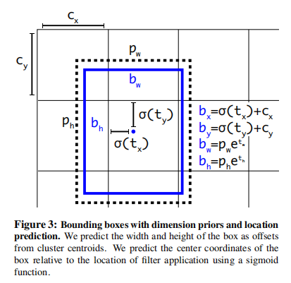

# YOLOv2

## Introduction

* Time: 2016.12
* Author: Joseph Redmon, Ali Farhadi

## Detail

### Better

**Batch Normalization:** 在每一个卷积层后添加BN层，并且去除Dropout

**High Resolution Classifier:** 原来使用(224, 224)的输入，现在使用(448, 448)的输入

**Convolutional With Anchor Boxes:** 移除最后的全连接层。对预测框坐标的预测采用基于anchor的方法，预测相对位置偏移和缩放。输入维度为(416, 416)，特征图维度为(13, 13)。检测头的输出仍然为坐标+置信度+类别

**Dimension Clusters:** 对训练集的标注框使用K-means聚类去获得好的anchor。某个框${\rm box}$和聚类中心${\rm centroid}$的距离为$d({\rm box}, {\rm centroid}) = 1-{\rm IOU(box, centroid)}$

**Direct location prediction:** 为了使预测的坐标中心点不要到另外的grid中，采用如下图所示的坐标预测。这里的Direct是指将宽高和预测框的中心点坐标独立开。

**Fine-Grained Features：** 
