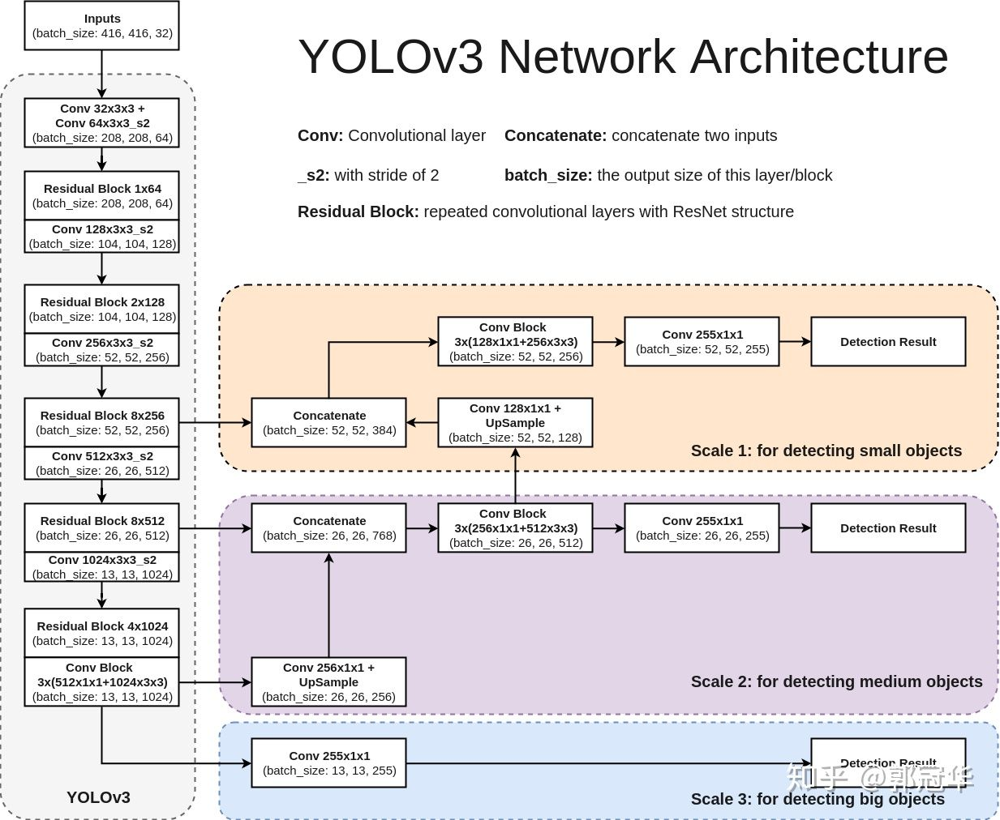

# YOLOv3

## Introduction

* Time: 2018.04
* Author: Joseph Redmon, Ali Farhadi

## Detail

### Feature Extractor

采用了一种新的主干网络，Darknet-53。结合了YOLOv2中的Darknet-19和残差连接。

### 多尺度预测

YOLOv3中不仅仅使用backbone的最后输出，还是使用中间层的输出。每一个输出的维度都不一样，这样在高分辨率的特征图上可以预测小目标，在低分辨率的特征图上可以预测大目标。

如果输入图片的维度是$416\times 416$，那么输出的三个特征图就是$13\times 13$, $26\times 26$, 以及$52\times 52$

### 先验框

同样是和YOLOv2中类似，使用聚类在数据集上获得了9中Anchor，然后给每个特征图的每个grid分配三个先验框。

### 网络输出

网络输出的维度为$13\times 13\times 3\times (4+1+80)$, $25\times 25\times 3\times (4+1+80)$, 以及$52\times 52\times 3\times (4+1+80)$。

* 其中4是指预测框的坐标，**同**YOLOv2。
* 1是指物体的检测置信度，用sigmoid解码，**类似**YOLOv1。
* 80是分类结果，使用独立的logistic分类器，取消类别之间的互斥，这样可以达到多标签分类，**类似**YOLOv1。

综上所述，网络结构图如下：

### 训练过程

训练过程需要对所有的预测框增加标注信息以进行有监督训练，损失函数由三个部分组成：坐标回归损失、物体置信度损失和分类损失。

1. 首先需要给每个grid分配其需要负责的真实框，与yolov1类似，如果某个真实框的中心落在了某个grid中，那么就由这个grid负责这个真实框。
2. 每个真实框此时会有9个anchor与其对应
   1. 选择其中IOU最高的anchor负责回归到这个真实框，根据这个anchor做出的预测框的物体检测置信度也标注为1。这些预测框的类别要向真是类别进行回归，预测框坐标也要向真实框进行回归。如果两个真实框落在同一个网格上，并且还匹配了同一个anchor，那么就由后来的顶替先前的，这是yolov3的一个缺点
   2. 那些IOU不是最大的，但是和任一真实框的IOU大于某个阈值（原文中为0.5）的anchor其对应的预测框标注为ignore。这些anchor都不计算loss。如果没有这个步骤，那么就会存在negative数量远远大于positive，导致网络倾向于将所有预测框都预测为negative。此外，这个ignore起到了让不够好但是也不差的anchor有未来成为positive的机会。
   3. 其余的标注为negative，检测置信度标注为0

$$
loss_{N_1} = \lambda_{box}\sum_{i=0}^{N_1\times N_1}\sum_{j=0}^{3}{1_{ij}^{obj}[(t_x - t_x')^2 + (t_y - t_y')^2]}
\\+\lambda_{box}\sum_{i=0}^{N_1\times N_1}\sum_{j=0}^{3}{1_{ij}^{obj}[(t_w - t_w')^2 + (t_h - t_h')^2]}
\\- \lambda_{obj}\sum_{i=0}^{N\times N}\sum_{j=0}^{3}{1_{ij}^{obj}log(c_{ij})}
\\-\lambda_{noobj}\sum_{i=0}^{N_1\times N_1}\sum_{j=0}^{3}{1_{ij}^{noobj}log(1-c_{ij})}
\\-{\lambda}_{class}\sum_{i=0}^{N_1\times N_1}\sum_{j=0}^{3}{1_{ij}^{obj} \sum_{c \in classes }[p_{ij}'(c)log(p_{ij}(c))+(1-p_{ij}'(c))log(1-p_{ij}(c))] }
$$

**TODO：** 上述过程有较多歧义，原文中的表述也不够清晰。需要结合代码确认

### 推理过程

设定置信度阈值之后，过滤置信度阈值过低的预测框，再经过NMS就可以得到输出。

## Reference

1. [近距离观察YOLOv3](https://zhuanlan.zhihu.com/p/40332004)
2. [【论文解读】Yolo三部曲解读——Yolov3](https://zhuanlan.zhihu.com/p/76802514)
