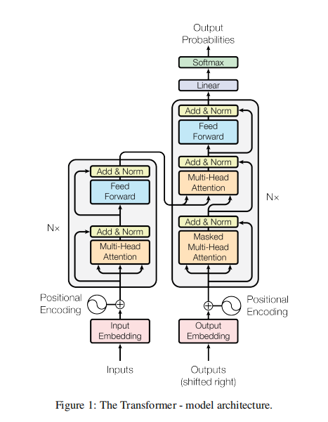
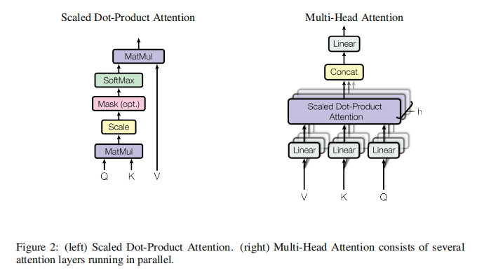

# Attention Is All You Need

## Introduction

* Time: 2017.06
* Author: Ashish Vaswani 等

提出了一种名为Transformer，基于注意力机制，同时又和循环神经网络和卷积神经网络完全不同的网络结构。这种结构拥有更好的并行度以及对训练时间更加友好。

除了难以并行化的这个缺点，循环网络中主要依赖一个隐藏状态$h_t$来从前向后传递信息，但是$h_t$的容量是有限的，如果想要对一个长序列进行建模，就需要使用维度很高的$h_t$，这样对内存造成了压力。

## Model Architecture

Transformer采用的Encoder-Decoder结构，并且是一个自回归模型。在Encoder和Decoder中，都使用了堆叠的self-attention和全连接层。

### Encoder

编码器由$N=6$个相同的层构成。每层由两个子层构成，第一层是多头自注意力机制层；第二层是全连接的前馈神经网络。每一个子层中我们使用了残差连接和Layer Normalization。为了方便残差连接，每一层中的输出（包括embedding层）都是$d=512$维。

对于这个模型来说，只有两个超参数，N和d，调参简单。

#### Layer Normalization

对于BatchNorm，需要记住整个训练集的方差和均值。但是对于语言这种序列模型，之前的方差和均值对于新的数据可能效果不够好。LayerNorm是对每一个样本做Normalization，这样子对于新的极端数据不敏感。

### Decoder

解码器同样是由$N=6$个相同的层堆叠而成。相对于编码器来说，解码器在两个子层中间插入了第三个子层，用来接收编码器的输出。同样采用了残差连接和Layer Normalization.

因为Transformer是一个自回归性质的模型。在预测时，t时刻无法得知t时刻之后的输出。由于self-attention具有一次性读取所有输入的特性，所以Decoder设计了Masked Multi-Head Attention，保证训练时t时刻没有办法看到t时刻之后的输入（将q和k计算出来的值换成一个小的负数，softmax之后就变为0）。

### Attention

将一个query和一系列key-value映射到output。这里的query、keys、values和output都是向量。output是values的加权和，这里的权重是通过query和keys的相似度算来的。

#### Scaled Dot-Product Attention

这里采用内积（余弦相似度）来计算query和key之间的相似度。使用矩阵乘法表示如下：

$$
{\rm Attention}(Q, K, V) = {\rm softmax}(\frac{QK^T}{\sqrt{d_k}})V
$$

其中$d_k$是query和keys向量的维度。

通常由两种方法处理query和keys的相似度。第一种是additive attention，这种方式采用一个单隐藏层的全连接层来计算，并且适用于query和keys不等长的情况。但是原文中说点积注意力在实践中可以采用高性能的矩阵乘法代码。

这里采用Scaled原因是在$d_k$比较大的时候，很可能点积出的向量的每个元素之间的相对大小差距会很大，经过softmax之后，会让某一个趋近于1，其他全部趋近于0，这样会导致梯度较小。从实际意义上来说，self-attention最初的想法就是一次性看到所有的输入，如果某一个输入的权重是1，就与这个初衷相违背。

#### Multi-Head Attention

如果将每一个输入本身作为QKV的话会使得模型的复杂度过低，所以通过投影得到每个头对应的Q、K、V，在多个不同的投影空间中捕捉不同的信息。增加模型复杂度和可学习的参数。计算公式如下

$$
{\rm MultiHead}(Q, K, V) = {\rm Concat}(head_1, ..., head_h)W^O\\
head_i = {\rm Attention}(QW_i^Q, KW_i^K, VW_i^V)
$$

#### Attention在该模型中的应用

对于decoder来说，queries是从之前的decoder层的输出，keys和values是encoder的输出。

对于encoder来说，queries、keys和values都源于相同的地方，所以也叫self-attention

#### 前馈网络

对序列中的每一个向量使用相同的2层MLP进行语义空间的转换。中间层的输出维度为2048，输入和输出维度为512.

#### Embeddings

将词映射为一个词向量

#### Positional Encoding

Attention机制忽略了序列中不同向量之间的相对位置信息。所以在输入中加入时序信息，将时序信息用512维的向量表示出来。

### Why Self-Attention

self-attention和卷积、RNN相比，计算复杂度相差不大。主要的优势在于能都对超长序列进行建模。

但是self-attention对于数据做出的假设相对较少，所以需要更多的数据和更高的模型复杂度以及更长时间的训练。（**不懂**）
